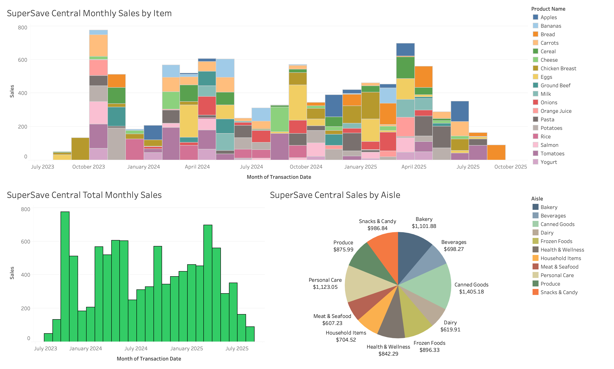
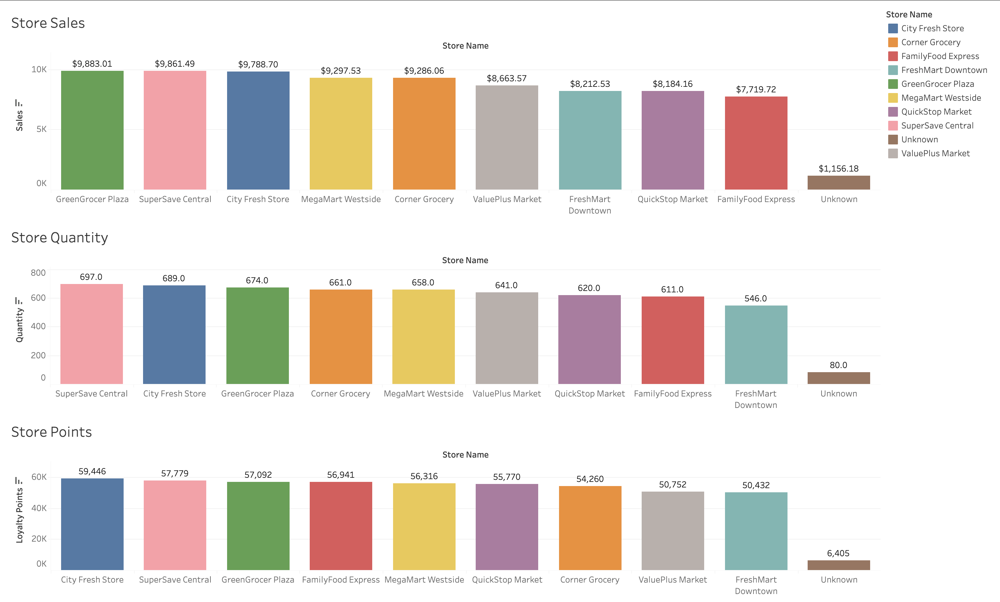
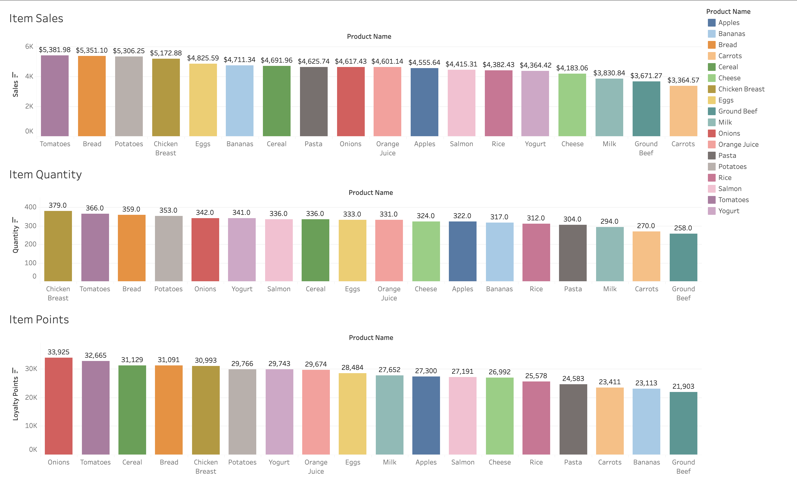
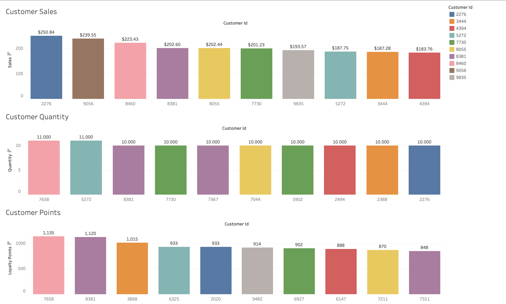
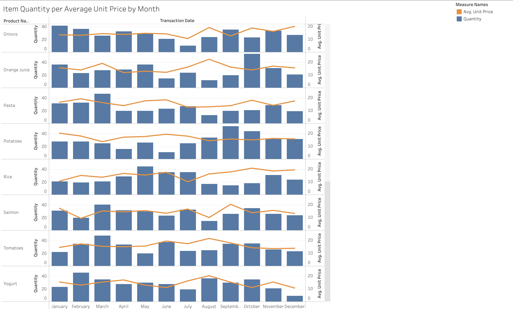

# 🛒 Grocery Store Data Analysis Project
This project details the loading, cleaning, and exploration of a dataset of grocery store transactions with varying items, quantities, discounts, prices, and store locations.

## Tools Used
- Python (pandas)
- Google Colab
- Tableau

## Project Workflow
### 1. Loading Dataset
Loading public dataset from Kaggle into Google Colab notebook as a pandas dataframe.

### 2. Data Cleaning and Feature Engineering
Several steps of data cleaning and feature engineering such as replacing null values, clipping price columns with negative values, and assigning proper datatypes.

## 3. Exporting Dataset for use in Tableau
Cleaned dataset used to create several dashboards reporting metrics on unique store, item, and customer metrics.

## Tableau Dashboards
1. SuperSave Central Dashboard

2. Store Totals

3. Item Totals

4. Customer Totals

5. Item Quantity per Average Unit Price

## Final Dataset Columns
- Customer ID
- Store Name
- Transaction Date
- Aisle
- Product Name
- Quantity
- Unit Price
- Total Amount
- Discount Amount
- Final Amount
- Loyalty Points
- Sales (Final Amount Cleaned)
- Month

## Summary Insights
1. SuperSave Central location was the only store to place in the top 2 positions in terms of total sales, total quantity of items sold, and loyalty points issued. This was the primary reason to choose this location for its own dashboard.

2. Apples and Bread tend to have the most volatile average unit prices within the dataset, while Carrots and potatoes tend to have the most consistent average unit prices.

3. Customer 7658 took the top spot in both total quantity of items bought and loyalty points earned, yet did not place in the top 10 in terms of total sales.
   
## How to Run
